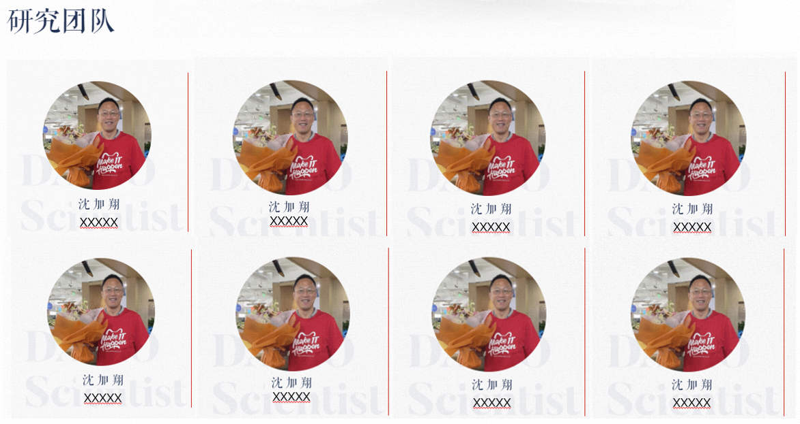

Nanyang Technological University and Alibaba Self-driving Lab are collaborating on autonomous driving technology research. which aims to develop reliable, interpretable, and verifiable autonomous simulation data solutions. The current research directions are as follows:

* Autonomous driving data mining and clustering

* Simulation scenario modeling and generation

* Safety scenario analysis and reconstruction

* Fault injection and adversarial attacks

* Accelerated longtail scenario generation

* Interactive scenario generation

We sincerely welcome more scholars to join our research work . 

TEAM INTRODUCTION
======
Nanyang Technological University and Alibaba Self-driving Lab are collaborating on autonomous driving technology research.

The Autopilot Lab is committed to researching the core technologies of autopilot, such as machine learning, integrated design of hardware and software, perception/decision planning/positioning, etc., so as to realize its productization, scale and commercialization, promote industrial reform with technological development, and carry the mission of empowering the important fields of national economy and people's livelihood such as logistics, transportation, safety, and municipal affairs with autopilot technology.

[LEARN MORE ABOUT US](https://flyover202305.github.io//topology-coverage-guided/)

ACADEMIC RESEARCH
======

In collaboration with Nanyang Technological University and Alibaba Autonomous Driving Lab, we have conducted the following research aimed at filling the above gaps. An overview of the scene hierarchy model (Bagschik et al. 2018) and the last relevant event. (Gelder, ED, et al., 2022). High-definition map-based functional safety testing of autonomous vehicles, Yun Tang

[Topology coverage-Guided Testing](https://flyover202305.github.io//topology-coverage-guided/)

     

[Collisoin Avoidance Testing](https://flyover202305.github.io//collisoin-avoidance/)

[HD Map Generation](https://flyover202305.github.io//HD-map-generation/)

[Generate interchanges](https://flyover202305.github.io//generate-interchanges/)

INDUSTRY INFLUENCE
======

Question: How complicated are the road conditions facing autonomous driving? How to simulate efficiently?

[LEARN MORE ABOUT OUR TECHNICAL INTERPRETION](https://flyover202305.github.io//HD-map-generation/)

     

<iframe 
src="../videos/sample.webm" 
scrolling="no" 
border="0" 
frameborder="no" 
framespacing="0" 
allowfullscreen="true" 
height=600 
width=800> 
</iframe>

